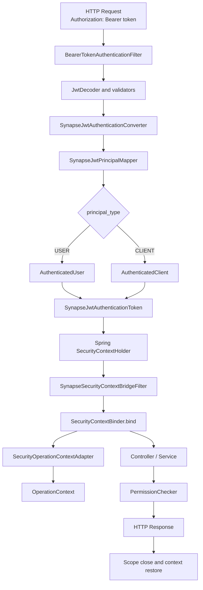

# Security 与 OAuth2 请求链路

本文只讨论当前 Framework 中的技术链路，不讨论 IAM 登录、用户管理、客户端管理、授权码、Refresh Token 存储等平台业务。

## 1. 先区分两个安全上下文

Servlet Resource Server 中同时存在两套上下文：

### Spring SecurityContext

由 Spring Security 管理，保存 `Authentication`，负责：

- Bearer Token 认证流程。
- `SecurityFilterChain` 中的访问判断。
- Spring Security 生态兼容。

### Synapse SecurityContext

由 `synapse-security` 管理，保存 `AuthenticatedPrincipal`，负责：

- 向业务代码提供 Web 无关的当前主体。
- 支持 `PermissionChecker`。
- 适配为 core 的 `OperationContext`。
- 让 data、audit、mq 等模块无需依赖 Spring Security。

两者不是重复实现，而是职责不同：

```text
Spring SecurityContext
  -> 面向 Spring Security 认证框架

Synapse SecurityContext
  -> 面向 Synapse Framework 内部稳定契约
```

## 2. Servlet Resource Server 完整链路



## 3. 每一步具体做什么

### 3.1 `BearerTokenAuthenticationFilter`

这是 Spring Security Resource Server 的过滤器，不属于 Synapse Framework 自定义实现。

它负责从 HTTP 请求中提取 Bearer Token，并启动认证流程。

需要记住：

- Synapse 不应该自己再写一套 Bearer Token 解析器替代 Spring Security。
- 认证失败仍处在 Filter 链阶段，不会进入 Controller。

### 3.2 `JwtDecoder` 与 validators

JWT 在这里完成密码学和协议校验，例如：

- 签名。
- issuer。
- audience。
- 时间有效性。
- token type。
- denylist，前提是消费方提供真实 denylist 实现并开启相关能力。

校验通过只表示 token 可以信任，还没有完成 Synapse 主体模型转换。

### 3.3 `SynapseJwtAuthenticationConverter`

该类是 Spring Security 与 Synapse 安全模型之间的第一个核心适配器。

输入：

```text
Jwt
```

输出：

```text
SynapseJwtAuthenticationToken
```

它完成三件事：

1. 通过 `SynapseJwtPrincipalMapper` 生成 Synapse 主体。
2. 通过 authorities converter 生成 Spring Security authorities。
3. 保存 token 的必要元数据，例如 `jti` 和 `issuer`。

它不负责签名校验，也不负责把主体写入 Synapse `SecurityContext`。

### 3.4 `SynapseJwtPrincipalMapper`

该类负责把 JWT claims 映射为稳定的 Synapse 安全主体。

核心分支：

```text
principal_type = USER
  -> AuthenticatedUser

principal_type = CLIENT
  -> AuthenticatedClient
```

USER 主要映射：

```text
sub                -> userId
preferred_username -> username
 tenant_id          -> tenantId
roles              -> roles snapshot
permissions        -> permissions snapshot
```

CLIENT 主要映射：

```text
client_id   -> clientId
 tenant_id   -> tenantId
roles       -> roles snapshot
permissions -> permissions snapshot
```

关键约束：

- `principal_type` 必须明确。
- CLIENT 不得伪装成 USER。
- roles 和 permissions 是当前 token 携带的快照，不在 Framework 中查询数据库。
- mapper 不做业务授权推导。

### 3.5 `SynapseJwtAuthenticationToken`

它仍然是 Spring Security `Authentication` 体系中的对象，但额外持有：

- `AuthenticatedPrincipal`。
- token metadata。

它的作用是让后续 Bridge Filter 能从 Spring Authentication 中取出 Synapse 主体，而不需要再次解析 JWT claims。

### 3.6 `SynapseSecurityContextBridgeFilter`

该 Filter 位于 `BearerTokenAuthenticationFilter` 之后。

原因：只有 Bearer Token 认证完成后，Spring `SecurityContextHolder` 中才存在已经转换好的 `SynapseJwtAuthenticationToken`。

Filter 的核心行为：

```text
读取 Spring Authentication
  -> 取出 AuthenticatedPrincipal
  -> SecurityContextBinder.bind(principal)
  -> 执行后续 Filter / Controller
  -> try-with-resources 自动关闭 scope
```

这个 try-with-resources 是上下文安全的关键点。无论后续请求成功还是抛异常，作用域都必须关闭，避免线程池复用时污染下一次请求。

### 3.7 `SecurityContextBinder.bind`

它会同时建立两个作用域：

```text
AuthenticatedPrincipal
  -> Synapse SecurityContext ThreadLocal

AuthenticatedPrincipal
  -> SecurityOperationContextAdapter
  -> OperationContext
```

因此业务代码可以读取当前认证主体，而 data、audit、mq 等模块可以读取当前操作人。

### 3.8 `SecurityOperationContextAdapter`

它只做安全主体到操作主体的单向转换。

典型映射：

```text
AuthenticatedUser
  -> OperationActorType.USER

AuthenticatedClient
  -> OperationActorType.SERVICE
```

roles 和 permissions 不进入 `OperationContext`，因为 `OperationContext` 表达“谁在执行操作”，不承担完整授权快照。

### 3.9 `PermissionChecker`

业务方法可以显式调用：

```java
permissionChecker.require("sample:read");
```

或通过：

```java
@RequirePermission("sample:read")
```

声明式 AOP 最终仍转换为 `PermissionChecker.require(...)`。

注意：

- AOP 是适配方式，不是唯一安全边界。
- MQ、Task、Async、内部用例更适合显式调用。
- 当前默认实现只检查主体上的 permissions 快照。

## 4. 401 与 403 的区别

### 401 Unauthorized

表示没有成功建立认证主体，例如：

- 没有 Bearer Token。
- Token 无效或过期。
- issuer / audience 校验失败。
- token 已进入 denylist。

由 authentication entry point 负责统一响应。

### 403 Forbidden

表示请求已经认证，但当前主体没有访问权限。

由 access denied handler 负责统一响应。

不要把所有安全异常都转换成 401，否则调用方无法区分“需要重新登录”和“当前身份无权访问”。

## 5. `SynapseResourceServerConfigurer` 的作用

该类集中配置默认 Servlet Resource Server 行为：

```text
CSRF policy
  + stateless session
  + 401 entry point
  + 403 access denied handler
  + permit paths
  + anyRequest authenticated
  + JWT authentication converter
  + Bridge Filter order
```

它属于配置适配器，不是认证领域逻辑。

阅读时重点看：

- 默认是否无状态。
- 哪些路径允许匿名访问。
- 自定义 converter 在哪里接入。
- Bridge Filter 为什么放在 Bearer Filter 之后。
- 用户自定义 `SecurityFilterChain` 时默认链是否退让。

## 6. Authorization Server support 与 Resource Server 的边界

```text
Authorization Server Support
  -> 创建或提供签名密钥
  -> 提供 JWKSource / JwtEncoder
  -> 签发 JWT 的技术支持

Resource Server
  -> 获取公钥或 JWK
  -> 验证 JWT
  -> 映射主体
  -> 建立请求上下文
```

Resource Server 不应该创建私钥或 `JwtEncoder`。

Authorization Server support 不应该实现用户登录、客户端管理、授权码、Consent 或完整 IAM。

## 7. Reactive 链路为什么不同

WebFlux 中不能把 Servlet ThreadLocal 当作唯一上下文来源。

Reactive 版本使用：

- Reactive JWT converter。
- WebFilter。
- Reactor Context。
- `SynapseReactiveSecurityContext`。
- `SynapseReactiveOperationContext`。

语义与 Servlet 版本保持一致，但上下文传播机制不同。

## 8. 推荐源码阅读顺序

按下面顺序打开源码：

```text
1. SynapseResourceServerConfigurer
2. SynapseJwtAuthenticationConverter
3. SynapseJwtPrincipalMapper
4. SynapseJwtAuthenticationToken
5. SynapseSecurityContextBridgeFilter
6. SecurityContext
7. SecurityContextScope
8. SecurityOperationContextAdapter
9. PermissionChecker
10. 对应测试
```

不要先从 AutoConfiguration 开始。先理解对象如何协作，再看自动配置如何组装它们。

## 9. 手写练习

关闭源码后，尝试手写一个最小 mapper：

```text
输入：Jwt claims map
输出：AuthenticatedUser 或 AuthenticatedClient
要求：
- principal_type 必填
- USER 的 sub 必填
- CLIENT 的 client_id 必填
- username 缺失时回退到 userId
- roles / permissions 同时支持字符串和集合
- 不查询数据库
```

然后再写三个测试：

1. USER claims 能正确映射。
2. CLIENT claims 不会映射成 USER。
3. 缺失必填 claim 时明确失败。

能独立完成这组练习，基本就掌握了当前 OAuth2 到 Synapse Security 的核心桥接链路。